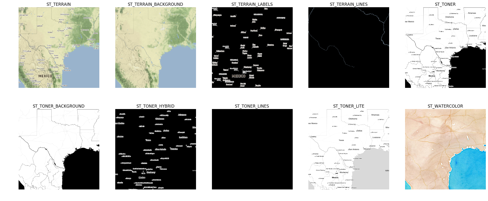

# `contextily`: context geo tiles in Python

`contextily` is a small Python 3 (3.6 and above) package to retrieve tile maps from the
internet. It can add those tiles as basemap to matplotlib figures or write tile
maps to disk into geospatial raster files. Bounding boxes can be passed in both
WGS84 (`EPSG:4326`) and Spheric Mercator (`EPSG:3857`). See the notebook
`contextily_guide.ipynb` for usage.

[](https://travis-ci.org/geopandas/contextily)
[](https://coveralls.io/github/darribas/contextily?branch=master)
[](https://mybinder.org/v2/gh/geopandas/contextily/master?urlpath=lab/tree/notebooks/intro_guide.ipynb)



The current tile providers that are available in contextily are the providers
defined in the [leaflet-providers](https://github.com/leaflet-extras/leaflet-providers)
package. This includes some popular tile maps, such as:

* The standard [OpenStreetMap](http://openstreetmap.org) map tiles
* Toner, Terrain and Watercolor map tiles by [Stamen Design](http://stamen.com)

## Dependencies

* `mercantile`
* `numpy`
* `matplotlib`
* `pillow`
* `rasterio`
* `requests`
* `geopy`
* `joblib`

## Installation

**Python 3 only** (3.6 and above)

[Latest released version](https://github.com/geopandas/contextily/releases/), using pip:

```sh
pip3 install contextily
```

or conda:

```sh
conda install contextily
```


## Contributors

`contextily` is developed by a community of enthusiastic volunteers. You can see a full list [here](https://github.com/geopandas/contextily/graphs/contributors).

If you would like to contribute to the project, have a look at the list of [open issues](https://github.com/geopandas/contextily/issues), particularly those labeled as [good first contributions](https://github.com/geopandas/contextily/issues?q=is%3Aissue+is%3Aopen+label%3Agood-first-contribution).

## License

BSD compatible. See `LICENSE.txt`
