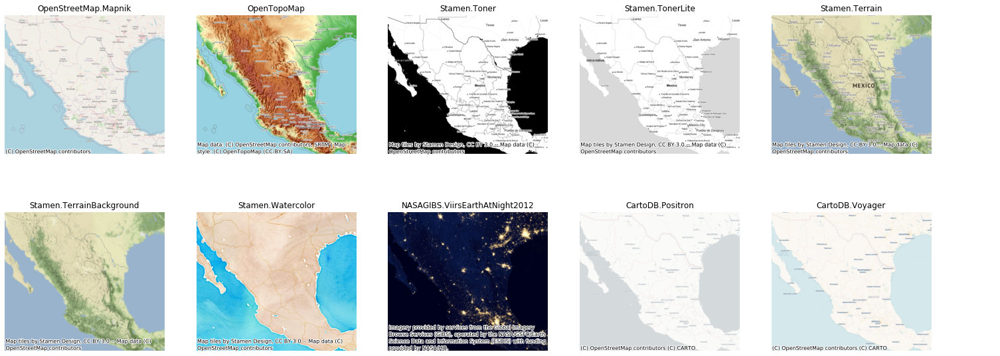

`contextily`: context geo tiles in Python
-----------------------------------------

`contextily` is a small Python 3 package to retrieve and write to disk tile maps from
the internet into geospatial raster files. Bounding boxes can be passed in both WGS84 (`EPSG:4326`) and Spheric Mercator (`EPSG:3857`). See the notebook
`contextily_guide.ipynb` for usage.

[](https://travis-ci.org/darribas/contextily)
[](https://coveralls.io/github/darribas/contextily?branch=master)



* Toner and Terrain map tiles by <a href="http://stamen.com">Stamen Design</a>, under <a
  href="http://creativecommons.org/licenses/by/3.0">CC BY 3.0</a>. Data by <a
  href="http://openstreetmap.org">OpenStreetMap</a>, under <a
  href="http://www.openstreetmap.org/copyright">ODbL</a>.
* Watercolor map tiles by <a href="http://stamen.com">Stamen Design</a>, under
  <a href="http://creativecommons.org/licenses/by/3.0">CC BY 3.0</a>. Data by
  <a href="http://openstreetmap.org">OpenStreetMap</a>, under <a
  href="http://creativecommons.org/licenses/by-sa/3.0">CC BY SA</a>.

## Dependencies

* `mercantile`
* `numpy`
* `matplotlib`
* `pillow`
* `rasterio`
* `requests`
* `geopy`
* `joblib`

## Installation

**Python 3 only**

[Latest released version](https://github.com/darribas/contextily/releases/tag/v0.99.0):
```sh
pip3 install contextily # installs the latest released version (v0.99.0)
```

Latest [release candidate](https://github.com/darribas/contextily/releases/tag/v1.0rc2) (includes functionality such as `add_basemap` coming in version 1.0:
```sh
pip3 install contextily==1.0rc2 # installs the latest release candidate (v1.0rc2) 
```


## Contributors

* [Dani Arribas-Bel](http://darribas.org/) ([`@darribas`](http://twitter.com/darribas))
* [Joris Van den Bossche](https://jorisvandenbossche.github.io/) ([`@levijohnwolf`](https://twitter.com/levijohnwolf))
* [Levi Wolf](http://ljwolf.org/) [`@jorisvandenbossche`](https://twitter.com/jorisvdbossche))
* [Chris Holdgraf](http://chrisholdgraf.com/) ([`@choldgraf`](http://twitter.com/choldgraf))
* [Filipe Fernandes](https://ocefpaf.github.io/python4oceanographers/) ([@ocefpaf](http://twitter.com/ocefpaf))

## License

BSD compatible. See `LICENSE.txt`
